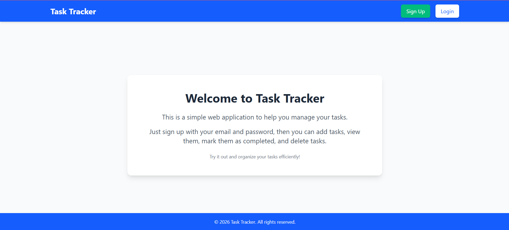
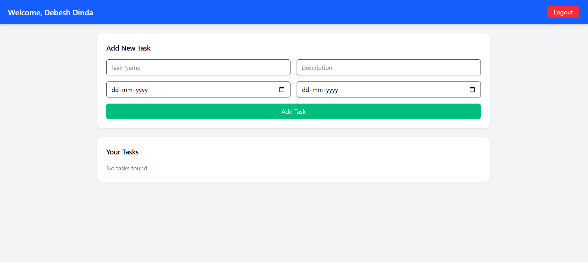
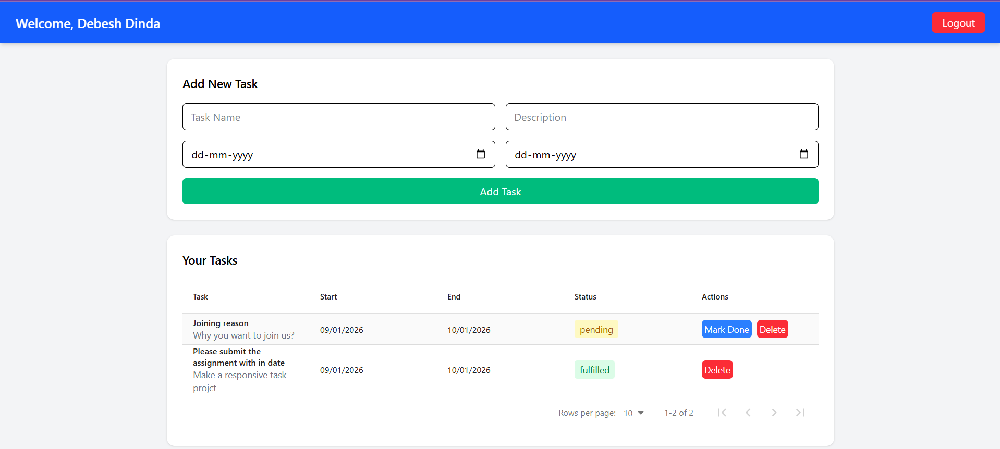

# Task Tracker Web Application

## Overview
**Task Tracker** is a modern full-stack web application designed to help users manage their tasks efficiently. Unlike the basic assignment requirements, this project implements **user authentication with cookies & JWT tokens** and a **beautiful, responsive interface using Tailwind CSS**.  

Users can **sign up, log in, add tasks, mark them as completed, and delete tasks**, all while enjoying a smooth and professional user experience.

---

## Features

### User Authentication
- Secure **Sign Up** and **Login** functionality  
- Passwords protected and JWT-based authentication  
- Cookies used for session persistence  

### Task Management
- Add new tasks with **Task Name, Description, Start Date, End Date, and Status**  
- View all tasks in a **beautiful responsive table**  
- Mark tasks as **Completed (Fulfilled)**  
- Delete tasks easily  
- **Validation**: Task Name ≤ 50 characters, Description ≤ 170 characters  

### Frontend
- Built with **React**  
- Styled using **Tailwind CSS** for a clean and modern look  
- Responsive design for mobile, tablet, and desktop  
- Data table with **pagination** using `react-data-table-component`  

### Backend
- Built with **Node.js** and **Express**  
- **MongoDB** database for storing users and tasks  
- RESTful APIs for authentication and task management  
- Fully integrated with frontend using **Axios**  

---

## Screenshots

### Landing Page


### Dashboard



### Task Table with Mark Done & Delete Buttons


---

## Tech Stack

| Layer       | Technology                   |
|------------ |----------------------------- |
| Frontend    | React, Tailwind CSS          |
| Backend     | Node.js, Express             |
| Database    | MongoDB                      |
| Auth        | JWT, Cookies                 |
| HTTP Client | Axios                        |

---

## Installation & Setup

1. **Clone the repository**

```bash
git clone https://github.com/your-username/TaskTracker.git
cd TaskTracker/NovaTechnology_assignment

2. **Backend Setup**
    cd Backend
    npm install
Create a .env file:
    MONGO_URI=your_mongodb_connection_string
    JWT_SECRET=your_jwt_secret
    PORT=5000

Run the server:
    npm run dev
Frontend Setup
    cd ../Frontend
    npm install
    npm start
##Project Structure
NovaTechnology_assignment/
├─ Frontend/        # React frontend
├─ Backend/         # Node.js + Express backend
├─ README.md        # Project documentation

## Live Demo 
    Author

Debesh Dinda
 MERN Stack Trainee

GitHub: https://github.com/debesh993

LinkedIn: https://www.linkedin.com/in/debesh-dinda-50b347301/

